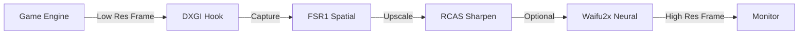

# 🎮 OmniForge - Real-Time Game Upscaling Framework 
**(v0.1 Production Build)**

[](https://opensource.org/licenses/MIT)
[](https://www.microsoft.com/windows)
[](https://isocpp.org/)
[]()

**OmniForge** is a high-performance C++ framework that injects into DirectX 11/12 games to provide real-time upscaling. It combines **AMD FSR1** (Spatial Upscaling) and **Waifu2x** (Neural Enhancement) to boost FPS while maintaining visual quality.

---

## 🚀 Current Status: v0.1 (Alpha)

We have successfully transitioned from a Python proof-of-concept to a **compiled C++ production application**.

### ✅ What's Working (Phase 1-3 Complete)
- **Core Injection Engine**: `omniforge_inject.dll` (18 KB) hooks into game processes.
- **CLI Tool**: `omniforge_app.exe` (13 KB) manages injection.
- **FSR1 Integration**: Real-time Edge-Adaptive Spatial Upscaling (EASU) + RCAS sharpening.
- **Neural Upscaling**: Standalone `waifu2x-ncnn-vulkan.exe` built and integrated.
- **DirectX Support**: DXGI hooking for DX11/DX12 games.
- **Performance Metrics**: Real-time FPS and frame time tracking.

---

## 📥 Installation

### Prerequisites
- Windows 10/11 (64-bit)
- Visual C++ Redistributable 2019+
- A DirectX 11/12 game

### Quick Start
1. **Download** the latest release (or build from source).
2. **Unzip** to a folder (e.g., `C:\OmniForge`).
3. **Run** the injector:
   ```powershell
   .\bin\omniforge_app.exe --inject "C:\Path\To\YourGame.exe"
   ```

---

## 🛠️ Building from Source

We have automated build scripts for all phases.

### Requirements
- Visual Studio 2022 (C++ Desktop Development)
- CMake 3.20+
- Git

### Build Steps

1. **Clone the repository**
   ```bash
   git clone https://github.com/Santhoshnadella/omniforge-0.1.git
   cd omniforge-0.1
   ```

2. **Build Core Components (Phase 1 & 2)**
   ```powershell
   .\build_production.bat
   ```
   *Builds `omniforge_inject.dll` and `omniforge_app.exe` with FSR1 integration.*

3. **Build Waifu2x (Phase 3)**
   ```powershell
   powershell -ExecutionPolicy Bypass -File .\build_phase3_waifu2x.ps1
   ```
   *Builds `waifu2x-ncnn-vulkan.exe` and installs neural models.*

---

## 🔬 Architecture

OmniForge uses a hybrid pipeline to balance performance and quality:



1. **Capture**: Intercepts `IDXGISwapChain::Present`.
2. **Spatial Upscale**: Uses FSR1 (EASU) for fast 2ms upscaling.
3. **Sharpen**: Uses RCAS to restore edge details.
4. **Neural Enhance**: (Optional) Passes frame to Waifu2x for texture hallucination.
5. **Present**: Displays the enhanced frame.

---

## 🗺️ Roadmap

- [x] **Phase 1**: Build C++ Injection Core (DLL/EXE) ✅
- [x] **Phase 2**: Integrate FSR1 (EASU/RCAS) ✅
- [x] **Phase 3**: Build Waifu2x Neural Engine ✅
- [ ] **Phase 4**: Real Game Testing (DX11/DX12) ⏳
- [ ] **Phase 5**: Performance Optimization (Async Compute)
- [ ] **Phase 6**: GUI Development (Qt6)
- [ ] **v1.0 Release**: Public Launch

---

## 📂 Project Structure

```
omniforge/
├── bin/                  # Compiled executables (waifu2x)
├── build/                # Build artifacts (DLL, EXE)
├── src/
│   ├── injector/         # DLL entry point & hooking
│   ├── capture/          # DXGI/Vulkan capture logic
│   ├── pipeline/         # FSR1 & Upscaling pipeline
│   └── utils/            # Metrics & logging
├── external/             # Dependencies (MinHook, FSR, ncnn)
├── docs/                 # Documentation
└── scripts/              # Build scripts
```

---

## 🤝 Contributing

Contributions are welcome! Please read [CONTRIBUTING.md](CONTRIBUTING.md) for details.

## 📜 License

This project is licensed under the MIT License - see the [LICENSE](LICENSE) file for details.

---

<div align="center">
  <b>Built with ❤️ by the OmniForge Team</b><br>
  <i>Making games look better, run faster.</i>
</div>
